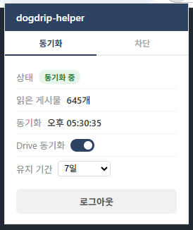
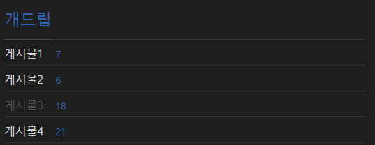
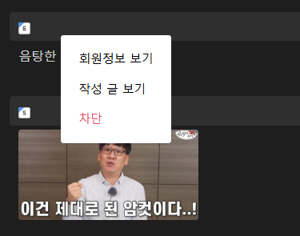
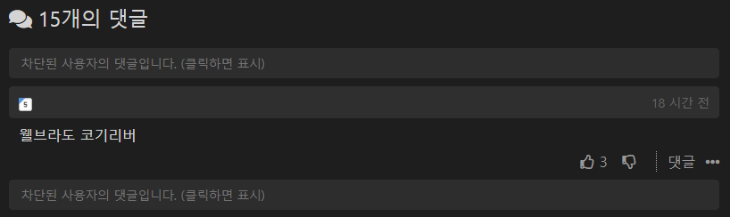
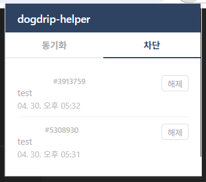

# dogdrip-helper

dogdrip.net 사용에 도움되는 Chrome 확장 프로그램입니다.

## 기능

### 읽음 동기화
- 읽은 게시물을 Google Drive에 저장하여 여러 기기에서 동기화
- 기기를 바꿔도 읽은 게시물이 흐리게 표시됨
- dogdrip 접속 시 자동 동기화
- 유지 기간 설정 가능 (7일 / 14일 / 30일 / 90일 / 무제한)

### 회원 차단
- 댓글 작성자 클릭 → 팝업에서 차단 버튼
- 차단된 회원의 댓글은 "차단된 사용자의 댓글입니다." 로 대체
- 클릭하면 확인 후 원본 댓글 표시
- 차단 목록 관리 (해제 가능)

## 설치

[Chrome 웹 스토어](#) 에서 설치

---

## 사용 방법

### 1. 읽음 동기화 설정

**처음 사용 시 Google 로그인이 필요합니다.**

1. 확장 프로그램 아이콘을 클릭하여 팝업을 엽니다
2. **동기화** 탭에서 **Google로 로그인** 버튼을 클릭합니다
3. Google 계정으로 로그인하면 자동으로 동기화가 시작됩니다



**유지 기간 설정**: 읽음 기록을 얼마나 오래 유지할지 선택할 수 있습니다 (기본 7일)

**Drive 동기화 토글**: 일시적으로 동기화를 끄고 싶을 때 사용합니다

로그인 후 dogdrip을 방문할 때마다 자동으로 읽음 기록이 동기화되며, 읽은 게시물은 흐리게 표시됩니다.



---

### 2. 회원 차단

1. 차단하고 싶은 댓글 작성자의 **닉네임을 클릭**합니다
2. 팝업 메뉴에서 **차단** 버튼을 클릭합니다



3. 차단된 회원의 댓글은 아래와 같이 대체됩니다
4. 클릭하면 원본 댓글을 확인할 수 있습니다



**차단 목록 관리**: 팝업의 **차단** 탭에서 차단된 회원 목록을 확인하고 해제할 수 있습니다



---

## 구조

```
dogdrip-helper/
├── manifest.json
├── background.js      # 서비스 워커 (Drive 동기화, 차단 관리)
├── content.js         # 페이지 스크립트 (읽음 감지, 차단 적용)
├── config.js          # CLIENT_ID (gitignore됨)
├── config.example.js  # config.js 템플릿
└── popup/
    ├── popup.html
    └── popup.js
```

## 데이터 저장

- 읽음 기록: 사용자 본인의 Google Drive `appDataFolder`
- 차단 목록: 기기 로컬 스토리지
- 개발자 서버 없음, 제3자 전송 없음

## 라이센스

MIT

---

## 개인정보처리방침

본 확장 프로그램은 사용자의 개인정보를 수집하거나 외부 서버로 전송하지 않습니다.

**수집하는 데이터**
- dogdrip.net에서 읽은 게시물 ID (숫자)
- 사용자가 직접 설정한 차단 회원 번호 및 메모

**저장 위치**
- 사용자 본인의 Google Drive (appDataFolder) — 개발자 서버 없음
- 사용자 기기의 로컬 스토리지

**제3자 공유**: 없음

**문의**: 94tiger@naver.com

최종 수정일: 2026년 4월
